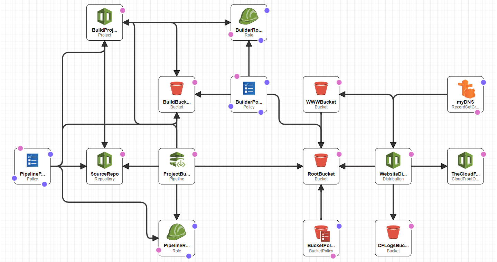

# Serverless Continuous Deployment Website builder

This repo contains a simple template for building a website auto deployment pipeline using the following AWS technologies:
* Code Pipeline
* Code Build
* Code Commit
* S3
* Route53
* Cloud Front
* and IAM roles and policies for the above

It assumes you've already bought the domain using Route53

Also included in this repo is a buildspec file to get a build started.

You'll need to deploy the templates in the following order:

0. Purchase the domain and choose yes when offered a hosted zone
1. certificate.template
  * This MUST be deployed in the N. Virginia (us-east-1) region
2. acm-validation.template
  * When the certificate stack is created it will pause on the "CREATE_IN_PROGRESS" step with a "Status reason" containing some details you'll need for this stack
3. cd-website.template
  * You'll need the ARN of the certificate for this stack

Given the root domain name (e.g. "google.com") this template will create
* a Record Set Group containing aliases for
  * 
* the following buckets:
  * root bucket (e.g. google.com)
    * will be a public bucket
    * will be set up to host a static website using
      * index.html for the index page
      * error.html for the error page
  * tld bucket (e.g. www.google.com)
    * will be set up to redirect traffic to the root bucket

